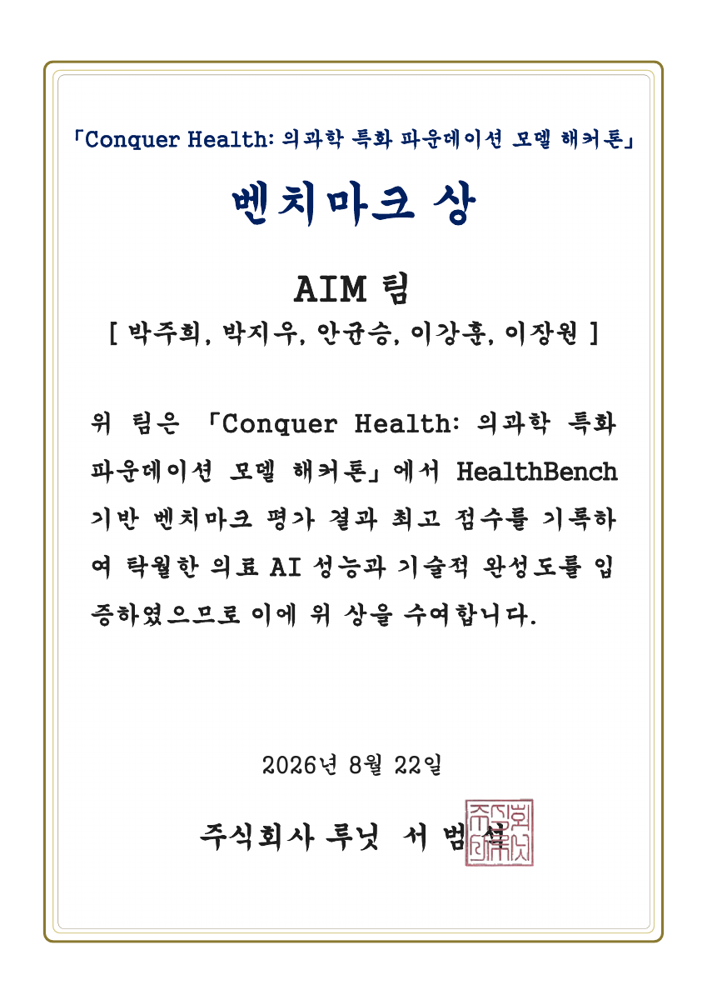

# 🏆 Conquer Health · Team AIM

**Lunit L2-preview 기반 의료 대화 시스템 — HealthBench 벤치마크 최고점**

[](docs/evidence/conquer-health-benchmark-award.pdf)


주어진 의료 파운데이션 모델이 질문에 충분히 답하고, 제한된 시간 안에 완결된 응답을 반환하도록 **프롬프트·선택적 검색·추론 예산·출력 검증**을 개선한 해커톤 프로젝트입니다. 모델 가중치를 학습하거나 파인튜닝하는 코드가 아닌, **추론 단계의 시스템 최적화**를 담고 있습니다.

[수상 및 증빙](#-수상-및-증빙) · [성능 개선](#-어떻게-성능을-개선했나) · [실행](#-실행) · [개발 기록과 수치](docs/performance.md)

## 🥇 수상 및 증빙

| 항목 | 내용 |
|---|---|
| 대회 | **Conquer Health: 의과학 특화 파운데이션 모델 해커톤** |
| 기간 / 장소 | 2026.08.21–08.22 · 서울 강남구 루닛 본사 |
| 주최 / 후원 | 루닛 / 과학기술정보통신부·정보통신산업진흥원(NIPA) |
| 수상 | **벤치마크 상 — HealthBench 기반 평가 최고점** |
| 팀 | **AIM** — 박주희, 박지우, 안균승, 이강훈, 이장원 |
| 참가 규모 | 15개 팀 · 70여 명 |

상장은 **HealthBench 기반 벤치마크 평가 최고점**을 명시합니다. 수상 기사에서도 AIM 팀의 벤치마크상 수상을 확인할 수 있습니다. 임상 현장 적용 가능성 등을 평가한 **프론티어상은 별도의 상**입니다.

- [상장 PDF](docs/evidence/conquer-health-benchmark-award.pdf)
- [인공지능신문 수상 보도 — 2026.08.26](https://www.aitimes.kr/news/articleView.html?idxno=41599)
- [증빙 목록과 확인 범위](docs/evidence/README.md)

<details>
<summary><strong>상장 보기</strong></summary>

<a href="docs/evidence/conquer-health-benchmark-award.pdf"></a>

</details>

## 💡 어떻게 성능을 개선했나

개발의 중심은 **추가 기능의 수보다 실제 평가에서 반환되는 답변의 품질과 완결성**이었습니다. 초기 다단계 검색 파이프라인에서 출발해, 개발 기록에서 더 높은 점수를 보인 L2 직접 생성 경로를 기본으로 채택하고 필요한 보완만 남겼습니다.

| 개선 영역 | 구현한 방법 | 해결하려는 문제 |
|---|---|---|
| **기본 생성 경로** | `PIPELINE=raw`: 대화 이력을 L2에 전달하고 직접 생성 | 모든 질문에 분류·검색·생성을 수행할 때 늘어나는 모델 호출과 지연 |
| **질문 커버리지** | 최신 사용자 턴에 답변 지시를 추가: 질문의 각 요구에 답하고, 필요한 경고와 결정적인 추가 정보 요청을 포함 | 질문 일부 누락, 진료 권유만으로 답변을 끝내는 현상 |
| **멀티턴 문맥** | 전체 요청 이력을 전달하고, 제공 가능한 검사 결과·약물 목록 등을 요청하도록 지시 | 앞선 대화가 있어도 필요한 정보를 활용하지 못하는 문제 |
| **선택적 MCP 조회** | 한국어의 명확한 약가·허가·적응증·질병코드 질의를 지정 도구에 매핑 | 공식 데이터가 필요한 질문의 사실성 보완, 불필요한 광범위 검색 회피 |
| **추론·출력 예산** | 기본 출력 예산 6,144토큰, 남은 시간에 따른 thinking 제어, 잘림·실패 시 non-thinking 재시도 | 사고 과정이 예산을 소모해 최종 답변이 비거나 끊기는 현상 |
| **출력 검증** | 기본 `REVIEW_MODE=suspect`: 규칙으로 결함을 탐지하고 필요한 경우만 L2로 수정 | 매번 비평 모델을 호출하는 비용과 지연 |
| **긴 답변 보존** | 출력 길이 보호 상한을 6,000자에서 12,000자로 확대 | 정상 답변 뒷부분의 조건·설명·주의사항이 잘리는 문제 |
| **실패 복구** | 재시도 예산, 동시 호출 제한, 짧은 직접 답변 폴백 | 상류 API 오류·혼잡으로 응답을 반환하지 못하는 문제 |

**증명된 성과는 벤치마크 최고점 수상입니다.** 각 변경의 점수 기여도와 최종 공식 점수는 별도의 원본 평가 결과가 필요합니다. 저장소의 `50.03`, `51.16`은 **개발 당시 기록**으로, 공식 최종 점수와 구분합니다. 자세한 근거와 한계는 [성능 개선 기록](docs/performance.md)에 정리했습니다.

## 🧭 현재 실행 구조

Docker의 실제 진입점은 **`app.py`의 FastAPI 서버**입니다.

```text
POST /v1/chat/completions · 대화 이력
  │
  ├─ 기본 raw 경로
  │    선택적 공식 데이터 조회 → 답변 지시 보강 → L2 직접 생성
  │
  ├─ 선택 harness 경로 (PIPELINE=harness)
  │    의도 분류 → 예산 내 MCP 검색 → 근거 기반 L2 생성
  │
  └─ 공통 출력 검증
       결함 의심 시에만 수정 → 초안 보존 / 실패 복구 → 응답
```

`raw`는 전면 검색을 기본으로 하지 않는 경로 이름입니다. 명확한 한국어 공식 데이터 조회에는 MCP가 선택적으로 사용됩니다. 조회가 실패하거나 지칭 대상이 불명확하면 직접 생성 경로로 돌아갑니다.

초기 구현인 `src/medai/`와 대안 드라이버 `submission/`도 실험 이력으로 남아 있습니다. 해당 경로의 모든 기능이 현재 `app.py` 기본 경로에서 실행되는 것은 아닙니다.

## 🚀 실행

### 준비 사항

- Python 3.13 또는 Docker
- 접근 가능한 Lunit L2 및 MCP 엔드포인트
- 환경변수 `LUNIT_FM_API_KEY`

해커톤 당시 엔드포인트의 현재 제공 여부는 보장되지 않습니다. 컨테이너 기동과 실제 모델 응답 성공은 별도로 확인해야 합니다.

```bash
git clone https://github.com/Hackathon-AIM/health-conquer-submission.git
cd health-conquer-submission

python3.13 -m venv .venv
source .venv/bin/activate
pip install -r requirements.txt

# 키는 쉘의 보안 입력 또는 실행 환경의 secret 관리 기능으로 설정합니다.
read -r -s -p "Lunit API key: " LUNIT_FM_API_KEY; echo
export LUNIT_FM_API_KEY

uvicorn app:app --host 0.0.0.0 --port 8000
```

위 키 입력 예시는 Bash 기준입니다. 서버는 환경변수를 읽으므로 `.env` 파일 생성만으로 설정이 적용되지는 않습니다.

### Docker

```bash
docker build -t aim-conquer-health .
docker run --rm -p 8000:8000 \
  -e LUNIT_FM_API_KEY \
  aim-conquer-health
```

### API 확인

```bash
curl http://localhost:8000/health
curl http://localhost:8000/v1/models

curl http://localhost:8000/v1/chat/completions \
  -H 'Content-Type: application/json' \
  -d '{"model":"Lunit/L2-preview","messages":[{"role":"user","content":"건강한 수면 습관을 알려주세요."}]}'
```

멀티턴 요청은 `messages`에 이전 사용자·assistant 메시지를 순서대로 포함합니다. `/health`는 서버 상태 확인용이며 상류 모델의 응답 성공까지 검증하지 않습니다.

### 주요 설정

| 환경변수 | 기본값 | 역할 |
|---|---|---|
| `LUNIT_FM_MODEL` | `Lunit/L2-preview` | 생성 모델 |
| `PIPELINE` | `raw` | `raw` / `harness` 경로 선택 |
| `FM_MAX_TOKENS` | `6144` | 모델 출력 토큰 예산 |
| `REQUEST_BUDGET_S` | `40` | 단계별 시간 배분 기준 |
| `REVIEW_MODE` | `suspect` | `off` / `suspect` / `always` |
| `REVIEW_MAX_CHARS` | `12000` | 출력 길이 보호 상한 |
| `FM_CONCURRENCY` / `MCP_CONCURRENCY` | `24` / `12` | 상류 동시 호출 제한 |

`REQUEST_BUDGET_S`는 응답 시간 보장이 아닙니다. 외부 타임아웃과 복구 호출에 추가 시간이 배정될 수 있습니다. `raw` 경로의 thinking 여부도 남은 시간과 폴백 조건에 따라 달라집니다.

## 🗂 코드 안내

| 파일 / 경로 | 역할 |
|---|---|
| [`app.py`](app.py) | 현재 서버, 직접 생성, 선택적 조회, 멀티턴 처리 |
| [`budget.py`](budget.py) | 시간 예산 및 호출 상한 |
| [`review.py`](review.py) | 출력 결함 검사와 선택적 수정 |
| [`router.py`](router.py), [`retrieval.py`](retrieval.py), [`generation.py`](generation.py) | 선택적 harness 경로 |
| [`compress.py`](compress.py), [`digest.py`](digest.py), [`toolspec.py`](toolspec.py) | 검색 근거 처리·압축·도구 정의 |
| [`mcp_client.py`](mcp_client.py) | 비동기 MCP 클라이언트 |
| [`tests/`](tests/) | 예산·검색·출력 검증·대안 드라이버 등의 회귀 테스트 |
| [`src/medai/`](src/medai/), [`submission/`](submission/) | 초기·대안 구현 |
| [`docs/performance.md`](docs/performance.md) | 성능 개선 근거와 개발 수치 |
| [`docs/evidence/`](docs/evidence/) | 수상 증빙 |

## 🧪 검증

현재 서버의 런타임 의존성은 `requirements.txt`에 있습니다. 저장소 전체 테스트와 초기 파이프라인 감사에는 추가 개발 의존성이 필요합니다.

```bash
pip install pytest pytest-asyncio pydantic PyYAML python-dotenv openai
make test
make audit
```

`make audit`는 **초기 `src/medai/` 파이프라인의 mock 감사**입니다. 테스트 통과를 공식 HealthBench 점수나 임상 검증으로 해석하지 않습니다. 이전 대회 준비 문서인 [L2 플레이북](docs/l2_playbook.md)과 [제출 절차](docs/submission.md)에는 당시 실험·설정이 남아 있으므로 현재 실행은 위 `app.py` 안내를 기준으로 합니다.

## 👥 Team AIM

**박주희 · 박지우 · 안균승 · 이강훈 · 이장원**

이 문서는 팀의 공동 결과물을 설명합니다. 수상명과 팀원은 상장을 기준으로, 구현 설명은 현재 코드와 커밋 이력을 기준으로 작성했습니다.
